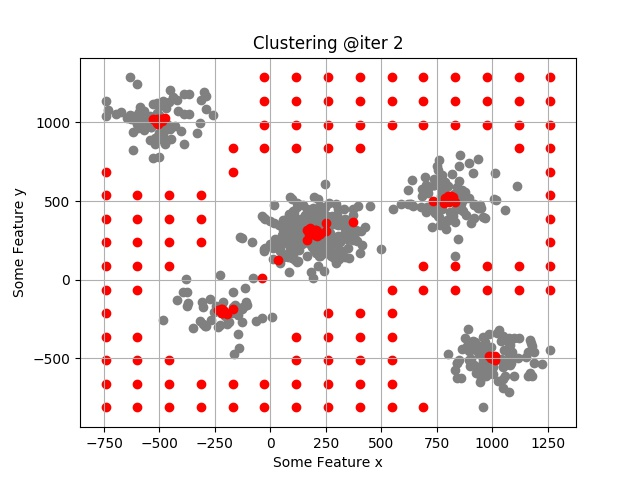

## MeanShift Clustering

Mean shift clustering is a sliding-window-based algorithm that attempts to find dense areas of data points. It is a centroid-based algorithm meaning that the goal is to locate the center points of each group/class, which works by updating candidates for center points to be the mean of the points within the sliding-window. These candidate windows are then filtered in a post-processing stage to eliminate near-duplicates, forming the final set of center points and their corresponding groups.

In contrast to K-means clustering there is no need to select the number of clusters as mean-shift automatically discovers this. That’s a massive advantage. The fact that the cluster centers converge towards the points of maximum density is also quite desirable as it is quite intuitive to understand and fits well in a naturally data-driven sense. 

The drawback is that the selection of the window size/radius “r” can be non-trivial.

More on Clustering: https://towardsdatascience.com/the-5-clustering-algorithms-data-scientists-need-to-know-a36d136ef68

### Generated Data

### Actual Cluster Centers

### Predicting Cluster Centers

* #### after Initialization
  

* #### after 2nd Iteration
  

* #### after 4th Iteration
  

* #### after 6th Iteration
  

### Final Mean Shift Clustering Result

