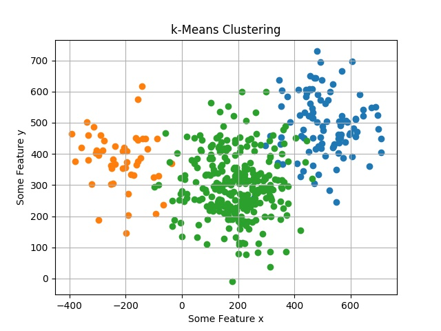
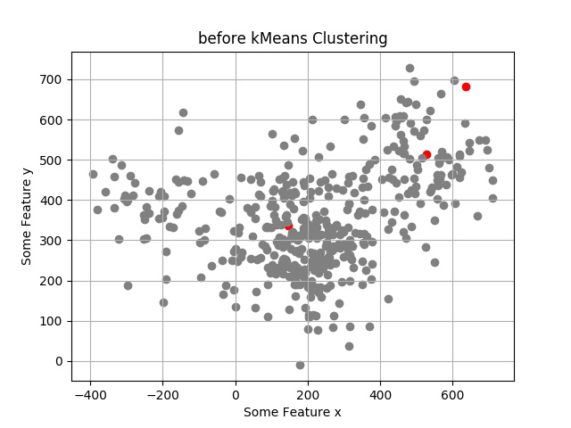
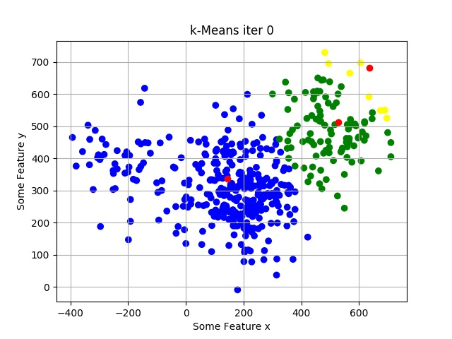
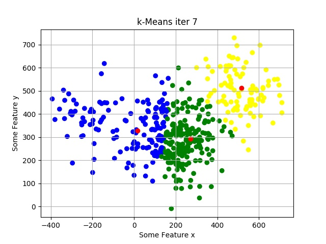

## kMeans Clustering

K-Means has the advantage that it’s pretty fast, as all we’re really doing is computing the distances between points and group centers; very few computations! It thus has a linear complexity O(n).

On the other hand, K-Means has a couple of disadvantages. Firstly, you have to select how many groups/classes there are. This isn’t always trivial and ideally with a clustering algorithm we’d want it to figure those out for us because the point of it is to gain some insight from the data. K-means also starts with a random choice of cluster centers and therefore it may yield different clustering results on different runs of the algorithm. Thus, the results may not be repeatable and lack consistency. Other cluster methods are more consistent.

More on Clustering: https://towardsdatascience.com/the-5-clustering-algorithms-data-scientists-need-to-know-a36d136ef68

### Generated Data

### Randomly Initialized Cluster Centers Before kMeans Algorithm

### Predicting Cluster Centers

* #### after 0th Iteration
  

* #### after 3rd Iteration
  

* #### after 7th Iteration
  

* #### after 10th Iteration
  

 ### Result of kMeans Clustering 
 
